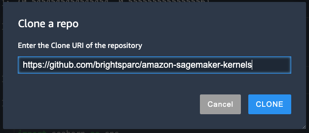

# Bring your own SageMaker Studio Image

This repository provides you a quick start for
 [Bringing your own custom container image to Amazon SageMaker Studio notebooks](https://aws.amazon.com/blogs/machine-learning/bringing-your-own-custom-container-image-to-amazon-sagemaker-studio-notebooks/).

## Prerequisites

In order to build a custom kernel your Amazon SageMaker Studio Execution role will require additional permissions, see the [PRE-REQS.md](PRE-REQS.md) for applying to an existing role.

Alternatively, you use the AWS CloudFormation stack `cloudformation\sagemaker-studio-infra.yaml` to setup a new SageMaker Studio domain and Execution role with sufficient permissions, or click the following button to launch the stack in `us-west-1` region.

This stack will return output parameters for the following resources
1. SageMaker Default S3 Bucket
2. SageMaker Studio Domain ID
3. SageMaker Studio Execution Role

## Open SageMaker Studio and Clone the notebook

1. Open the [SageMaker console](https://console.aws.amazon.com/sagemaker/)
2. Chose **Amazon SageMaker Studio** at the top left of the page.
3. On the **Amazon SageMaker Studio Control Panel**, choose the default username and then choose **Open Studio**.
4. Follow the instructions to [Clone a Git Repository](https://docs.aws.amazon.com/sagemaker/latest/dg/studio-tasks-git.html) and provide the repository `https://github.com/brightsparc/amazon-sagemaker-kernels`

Open the cloned folder to browse to the `r-kernel` folder.

## Build R Notebook Kernel for Sagemaker Studio

In the [r-kernel](r-kernel) example we use the [BUILD.ipynb](r-kernel/BUILD.ipynb) notebook to demonstrate how to
use the Sagemaker Studio Image Build CLI to build and register
a customer Notebook Kernel from within SageMaker Studio.

This allows allows you to run R code inside a SageMaker Studio Notebook.
