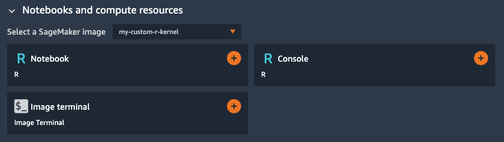

# Custom R-Kernel for Sagemaker Studio

In this example we will build a Notebook kernel that can be used inside Sagemaker Studio.

We will use the SageMaker Studio Image Build CLI so that the entire process can be done
from within Sagemaker Studio.

## Build Kernel

Follow the steps in [BUILD.ipynb](BUILD.ipynb) to build and register `my-custom-r-kernel` with SageMaker Studio.

## Attach Kernel

Open the [r_xgboost_batch_transform.ipynb](r_xgboost_batch_transform.ipynb) notebook and attach to the new `my-custom-r-kernel` to execute the R code.

## Launch Kernel

You can also Use the keyboard shortcut `Ctrl + Shift + L` to open Studio Launcher to create a new notebook with this R kernel:

